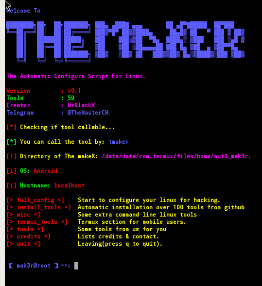

# aut0 mak3r



## Table of Contents

- [General Information](#general-information)
- [Changelog](#changelog)
- [Features](#features)
- [Installation](#installation)
- [Disclaimer](#disclaimer)
- [Credits](#credits)
- [Social Media](#social-media)
- [Bug Report](#bug-report)

# General Information

This project has been in development for a long time and already offers many features despite its small size. If you wipe a computer you might be annoyed by reinstalling tools manually—**aut0 mak3r** solves this problem for you.

Modules such as `full_config` install and configure many components automatically. "The maker" was the original name, so the logo remains. If you encounter any errors, please visit the [Bug Report](#bug-report) section. Feel free to request additional Termux tools.
  

# Changelog

### In Progress

- [x] Sources.list Backup/Restore
- [ ] Facebook Tools for Termux section
- [x] `install_tools` module for Linux section
- [x] Split `full_config` module into a separate menu
- [x] Add update checker

### Releases

- **0.3f** – modular loader and dynamic module support
- **0.3d‑Beta 1** – grammar fixes, UI design improvements,
  sources list backup, updated Tor Browser repo and separated driver installation
- **0.3b2** – beta update
- **0.3c‑Beta 2** – code improvements
- **0.3c‑Beta 1** – bug fixes, grammar fixes, UI updates and error log feature
- **0.3** – added a submenu for `full_config` and fixed some Termux commands
- **0.2** – fixed path errors, fixed misc commands and added update checker
- **0.1 (Beta)** – initial release with 59 tools, Termux, misc and ViperZCrew modules

# Features

  Some features are not yet available but will be coming soon

  * Full Linux Configuration (Sources, Kali Tools, OpenVPN...)
  * Pentesting Tools Installation (many GitHub tools)
  * Install Tools menu for automatic or manual tool installation
  * Cool Command Line Features (delete history, print all IPs in the network, check open ports... and much more!)
  * Termux Tools (Instagram attacks/Facebook attacks/Metasploit/DDoS)
  * Termux Update Installation (Updating Termux)
  * Termux Necessary Package Installation (Installing some packages)
  * Community Tools (Combo Editor, MySQL Exploiter, Proxyscraper, Dead Pinger, Password, Payloader, Evil Wifi, WhatSpam, B00t3r, FTP Exploit, Gmail Bruter, MAC Gen, Pentestbox, r00tw0rm, DDoS Scripts, SSH Exploit, JexBoss, Telnet Bruter)
  * Command Execution (tmaker)
  
# Disclaimer

  Use this tool for educational purposes only. 🕵️‍♂️
  If you perform any illegal attacks, I am not responsible for your actions.
  Use this tool correctly, and do not re-upload it to your GitHub repository without permission.

# Installation

  For Linux/Termux:
  
  ```git clone https://github.com/rebl0x3r/aut0_mak3r.git```
  
  ```cd aut0_mak3r && chmod +x *```

Run:

```bash
bash tmaker.sh
```

**Warning:** The tool relies on several folders—do not delete them!

- `backup` – stores DNS and `.bashrc` backups
- `lib` – libraries and other module tools (can be run manually)
- `openvpn` – login configurations and modules such as `openvpn.sh`
- `tools` – placeholder for future tools

## Modules

The launcher scans the `modules` directory and loads every `*.sh` file. Each
module can optionally set two variables that describe it:

```bash
MODULE_NAME="example"
MODULE_DESC="Example module description"
```

If these variables are provided, their values appear in the menu. The script
should also define a `run` function that performs the module action. New tools
become available simply by dropping a compatible file into `modules/`.

The `install_tools` module provides a menu-driven installer allowing automatic or manual installation of common tools.

# Credits

_Channels_

- [LeakerHounds](https://t.me/LeakerHounds)
- [ViperZCrew](https://t.me/ViperZCrew)
- [Deepwaterleaks](https://t.me/deepwaterleaks2)

_Contributors & Supporters_

- BlackFlare
- Legend
- MarCus
- [0n1cOn3](https://github.com/0n1cOn3)

**Current Maintainer:** [0n1c0n3](https://github.com/0n1c0n3)

_Developer & Contact_

[mrblackx2_0](t.me/mrblackx2_0)


# Social Media

Telegram

- @LeakerHounds
- @hx


# Bug Report

If you find any bug or issue, please go [here](https://github.com/rebl0x3r/aut0_mak3r/issues).
You can also request an update.

## Testing

Run the included checks before contributing:

```bash
cd tests
./syntax_check.sh
./test_modules.sh
```
